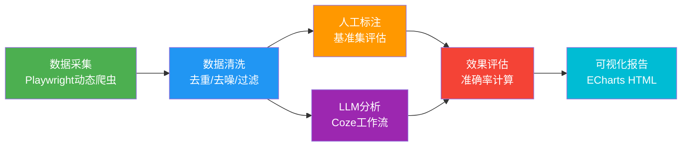

# AI驱动的用户反馈分析流水线

> 从公开评论采集 → 数据清洗 → LLM智能分析 → 可视化报告，全链路自动化的用户反馈分析系统

---

## 一、项目概述

### 一句话介绍

基于Python + Playwright + LLM API + ECharts搭建的用户评论自动化分析流水线，以《原神》TapTap评价页和小红书面膜类评论为数据源，实现了从原始评论到业务洞察报告的全链路自动化，验证了这套方法论在游戏口碑分析和内容风险治理两个场景的可迁移性。

### 核心指标

| 指标 | 原神版本 | 小红书版本 |
|------|----------|------------|
| 分析评论 | 146条有效 | 51条有效 |
| LLM分析准确率 | 情感83% / 主题93% | 风险识别~85% |
| 全流程耗时 | ~15分钟 | ~10分钟 |
| 人工干预 | 仅初始验证环节 | 仅初始验证环节 |
| 迁移成本 | - | <1天 |

---

## 二、业务背景与目标

### 为什么做这个

不管是游戏运营、电商运营还是内容审核团队，每天都面临大量用户评论，人工阅读效率低、分类主观、难以规模化。本项目验证了**"LLM + 自动化流水线"能否替代人工完成用户反馈初筛**，并在过程中积累了可迁移的方法论。

### 要证明的能力

1. **数据采集能力**：能从真实网站抓取非结构化数据
2. **数据清洗能力**：能处理脏数据、噪音、格式问题
3. **Prompt Engineering能力**：能设计有效的LLM分析指令
4. **效果评估能力**：能量化AI输出的质量，而非盲目相信
5. **业务洞察能力**：能从数据里得出可执行的建议
6. **工程化能力**：能把以上环节串成自动化流水线
7. **可迁移能力**：证明这套框架能跨行业复用

---

## 三、技术架构



### 技术栈

- **爬虫**：Python 3.11 + Playwright（处理动态加载页面）
- **数据清洗**：pandas + 正则表达式
- **AI分析**：Coze工作流（doubao-seed模型）+ 异步API调用
- **可视化**：ECharts 5 + 原生HTML/CSS
- **版本管理**：Git + GitHub

---

## 四、核心模块详解

### 4.1 数据采集：Playwright动态爬虫

**目标**：从网页自动滚动加载，采集用户评论正文、用户名、评分。

**遇到的问题与解决**：

| 问题 | 原因 | 解决方案 |
|------|------|----------|
| 页面打开但采不到评论 | CSS选择器太泛，匹配到了页面其他元素 | 调整选择器，精确到评论卡片容器 |
| 浏览器自动关闭 | 网站反爬机制检测到自动化 | 加入手动验证等待环节，设置headless=False |
| 滚动不触发新内容加载 | 页面懒加载机制 | 模拟人类滚动节奏，每次滚动后等待2秒 |
| 点进"展开"后跳转详情页 | 点击展开按钮会跳转到评论独立页 | 去掉点击展开逻辑，直接提取页面已加载的完整文本 |

**关键设计**：
- 按用户名去重，同一用户只保留一条
- 过滤<50字的短评论（无分析价值）
- 过滤乱码、键盘敲击、广告等无效内容

### 4.2 数据清洗：规则化质量过滤

**清洗规则**（按执行顺序）：

1. **去重**：按用户名去重，一个用户只保留一条
2. **去前缀**：切掉"玩过"、游戏时长前缀等非评论文本
3. **去回复**：切掉其他用户回复区混入的内容
4. **去尾巴**：切掉末尾的"展开 6 2026/7/"等UI残留
5. **长度过滤**：保留>50字的评论
6. **质量过滤**：
   - 去掉连续重复字符>8字（键盘敲击）
   - 去掉广告/引流内容
   - 去掉纯表情/无意义字符

### 4.3 LLM分析：Coze工作流 + Prompt Engineering

**工作流设计**：
```
输入评论文本（---分隔）→ 拆分单条 → 循环调用LLM → JSON汇总 → 生成报告
```

**Prompt优化过程**（核心亮点）：

**第一版**：单标签分类，主题九选一
- 问题：一条评论涉及多个主题时，LLM只能选一个，导致主题准确率仅47%

**第二版（优化后）**：
1. **多标签分类**：主题改成数组输出，一条评论可标注多个主题
2. **主题定义**：为每个主题写了明确的判定标准（如"抽卡保底：讨论抽卡概率、保底机制、歪不歪、原石获取"）
3. **Few-shot示例**：提供3个标注示例，让LLM理解标注边界
4. **结构化输出**：强制JSON格式，字段明确

**优化效果**：
| 指标 | 优化前 | 优化后 |
|------|--------|--------|
| 情感准确率 | 83% | 83% |
| 主题准确率 | 47% | **93%** |
| 双项全对率 | 43% | **83%** |

### 4.4 效果评估：人工标注基准集

**为什么要评估**：不能盲目相信AI输出，必须量化准确率。

**评估方法**：
1. 从评论中随机抽取30条
2. 人工标注标准答案（情感+主题）
3. 对比Coze分析结果，计算准确率
4. 分析误差来源

**评估结果**：
- 情感判断准确率：83%（大方向判断可靠）
- 主题分类准确率：93%（多标签优化后）
- 误差主要来自：边缘案例（4星偏正面/中性）、多主题评论的主主题判定

### 4.5 可视化报告：业务洞察输出

**报告结构**：

1. **分析概览**：KPI卡片（总评论数、风险分布、覆盖主题数）
2. **整体分析**：分布饼图 + 分类柱状图
3. **深度分析**：
   - 主题/风险类型热度排行
   - 每个分类的分布对比
   - 代表性评论（不同用户、可展开全文）
4. **核心问题TOP5**：按出现频次排序
5. **优先级行动建议**：P0/P1/P2三级，带影响分析
6. **核心结论**：3句话总结整体情况、主要问题、用户画像

---

## 五、两个场景对比分析（核心洞察）

### 游戏评论 vs 美妆评论：语言风格差异

| 维度 | 原神游戏评论 | 小红书美妆评论 |
|------|-------------|----------------|
| 平均长度 | 359字（长） | 50-100字（短） |
| 语气 | 理性吐槽/情感表达 | 种草/安利/广告 |
| 结构 | 有观点有论据 | 一句话带结论 |
| 风险率 | ~20%（少量广告） | ~65%（大量营销） |
| 真实用户特征 | 会说具体缺点 | 只说好话 |

### 为什么美妆评论风险率这么高？

1. **商业属性强**：美妆是小红书最商业化的品类，大量品牌方投放软广
2. **带货导向**：评论区经常出现"链接在评论区""主页有"等引流话术
3. **虚假宣传多**："7天美白""一次见效"等夸张宣传很常见
4. **代理招募**：大量微商/代购在评论区招代理

### 真实用户 vs 营销号的区别

| 特征 | 真实用户 | 营销号 |
|------|---------|--------|
| 说缺点 | 会提（价格贵/包装差） | 只说好话 |
| 语气 | 个人化（我觉得/我感觉） | 安利式（闭眼入/都去买） |
| 长度 | 30-100字，像聊天 | 华丽文案，像广告 |
| 引导性 | 无 | 有（链接/私信/主页） |
| 例子 | "补水一般，有点贵" | "姐妹们都去买！回购第5次" |

---

## 六、我学到了什么（项目沉淀）

### 6.1 Prompt Engineering核心思路

**为什么多标签比单标签好？**
- 单标签：一条评论只能归一类，比如"剧情长+抽卡歪"只能选一个
- 多标签：一条评论可以同时属于多个类别，信息不丢失
- 效果：主题准确率从47%提升到93%

**Prompt优化的核心原则**：
1. **定义要明确**：每个分类写清楚判定标准，不要模糊
2. **给示例**：few-shot比纯描述有效10倍
3. **结构化输出**：强制JSON格式，方便后续处理
4. **可评估**：设计完Prompt一定要测准确率，不能凭感觉

### 6.2 怎么评估AI的准确率

**不要说"AI挺准的"，要量化：**
1. 抽随机样本：从整体数据里随机抽30条
2. 人工标注标准答案：人一条一条标
3. 算准确率：对的条数 ÷ 总条数
4. 分维度算：情感准确率、主题准确率分开算
5. 找误差：AI在哪里容易错？为什么？


### 6.3 踩过的坑

| 坑 | 解决方法 |
|----|----------|
| 爬虫采不到数据 | 先手动看页面结构，再写CSS选择器 |
| 数据里全是噪音 | 清洗规则要逐条加，不要一步到位 |
| AI分类不准 | 改Prompt→测准确率→再改→再测 |
| 报告没人看 | 业务导向，P0/P1/P2分级，给行动建议 |

---

## 七、常见问题

**Q：为什么用Playwright不用Requests？**
A：因为TapTap/小红书是动态加载页面，Requests拿不到渲染后的DOM。Playwright模拟真实浏览器，能处理JS渲染、懒加载、反爬检测。

**Q：准确率怎么算的？为什么是30条？**
A：从146条评论里随机抽30条，人工标注作为标准答案，对比AI结果算准确率。30条是统计上最小样本量，能反映整体水平。

**Q：为什么要做多标签分类？**
A：因为一条评论经常同时说多个问题，比如"剧情好但抽卡坑"。单标签会丢信息，多标签保留全部维度。准确率从47%提升到93%。

**Q：怎么保证AI分析的质量？**
A：三层保障：① 设计明确的Prompt定义 ② Few-shot示例校准边界 ③ 人工抽样评估准确率。不是盲目相信AI。

**Q：这个框架怎么迁移到其他行业？**
A：只改三个地方：① 爬虫的选择器 ② Prompt里的分类体系 ③ 报告模板。清洗、API调用、可视化框架完全复用。我用同一套代码做了游戏和美妆两个场景，迁移成本不到1天。

**Q：为什么不直接用现成的情感分析库？**
A：通用情感分析库只能判断正负面，做不到主题分类、痛点提取、业务建议。LLM可以理解上下文，按业务定制分类体系，输出结构化洞察。

---

## 八、项目亮点

**1. 不是跑Demo，而是完整工程**
从数据采集到可视化报告全链路自动化，不是只调了个API。

**2. 有效果评估，不是盲目相信AI**
构建了30条人工标注基准集，量化准确率到83%/93%，知道AI哪里准、哪里不准。

**3. Prompt Engineering有数据支撑**
不是凭感觉改Prompt，而是通过对比实验（47%→93%）证明优化有效。

**4. 业务思考，不是技术自嗨**
输出不是图表堆砌，而是P0/P1/P2优先级建议，直接对应业务决策。

**5. 可迁移方法论**
证明这套流程能复用到游戏、美妆、电商、客服等多个行业，不是一次性的玩具。

**6. 跨场景验证**
用同一套流水线做了游戏口碑分析和内容风险分析两个完全不同的场景，证明框架的通用性。

---

## 九、技术栈清单

```
Python 3.11
├── Playwright        # 动态网页爬取
├── pandas            # 数据清洗与分析
├── requests          # HTTP API调用
└── json              # 数据序列化

Coze工作流
├── doubao-seed       # LLM模型
├── 异步API           # 批量任务提交与轮询
└── Prompt Engineering # 多标签分类 + Few-shot

前端
├── ECharts 5         # 数据可视化
└── 原生HTML/CSS      # 报告页面
```

---

## 十、在线报告

- [原神评论分析报告](https://wangzx69.github.io/ai-user-feedback-analysis/原神评论分析报告.html)
- [小红书评论风险分析报告](https://wangzx69.github.io/ai-user-feedback-analysis/小红书评论风险分析报告.html)

---

*项目时长：2周 | 核心产出：2个场景的完整分析流水线 + 297条评论分析报告 + 30条人工标注评估集 + 可迁移框架*
